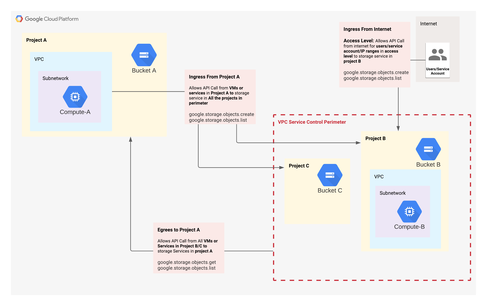

# VPC Service Control Egress and Ingress Policies

  

##  From Internet

###  Browse data from buckets in project B.
`PASS` as there is an ingress policy which allows `storage.objects.list` from internet

```bash
gsutil ls gs://sin-prj-sp-b
```

###  Copy data to buckets in project B.
`PASS` as there is an ingress policy which allows `storage.objects.create` from internet

```bash
echo "test test" >> test.txt
gsutil cp test.txt gs://sin-prj-sp-b
```
###  Copy data from buckets in project B.
`FAIL` Since there is no egress policy which allows `storage.objects.get` from internet.


```bash
gsutil cp gs://sin-prj-sp-b/test.txt .
```


##  From Project A

###  Browse data from buckets. 
`PASS` as there is an ingress policy which allows `storage.objects.list` from project A

```bash
gsutil ls gs://sin-prj-sp-b
```

###  Copy data to buckets. 
`PASS` as there is an ingress policy which allows `storage.objects.create` from project A

```bash
gsutil cp test.txt gs://sin-prj-sp-b
```

###  Copy data from buckets. 
`FAIL` since there is no ingress policy which allows `storage.objects.get` from project A.

```bash
gsutil cp gs://sin-prj-sp-b/test.txt .
```


##  From Project B

###  Browse data from buckets in project A.
`PASS` as there is an egress policy which allows `storage.objects.list` to project A

```bash
gsutil ls gs://sin-prj-no-sp-a
```

###  Copy data from buckets in project A.
`PASS` as there is an egress policy which allows `storage.objects.get` from project A.


```bash
gsutil cp gs://sin-prj-no-sp-a/test.txt .
```

###  Copy data to buckets  in project A.
`FAIL` since there is no egress policy which allows `storage.objects.create` to project A

```bash
gsutil cp test.txt gs://sin-prj-no-sp-a
```

###  Browse, Copy data to and from buckets  in project C.

`FAIL` since there is no egress or ingress policy to project C,

```bash
gsutil ls gs://sin-prj-sp-c
gsutil cp test.txt gs://sin-prj-sp-c
gsutil cp gs://sin-prj-sp-c/test.txt .
```


## Copy data between buckets
###  From Internet 
Although there is an ingress policy which allows `storage.objects.create` from Internet to project B but an egres policy `storage.objects.create` is also needed in order to copy in either direction. 
This will `FAIL` unless we create an egress policy `storage.objects.create` which will be risky as it will allow copy data `TO` and `FROM` project B.

```
From Documentation
Ingress and egress rules are agnostic of the API request semantics and the data movement direction.
```

###  Copy project A to project B

```bash
gsutil cp gs://sin-prj-no-sp-a/test.txt gs://sin-prj-sp-b/
```

#### LOG:

```json
{
  "protoPayload": {
    "@type": "type.googleapis.com/google.cloud.audit.AuditLog",
    "authenticationInfo": {
      "principalEmail": "imrannayer@google.com"
    },
    "requestMetadata": {
      "callerIp": "47.185.201.158",
      "requestAttributes": {},
      "destinationAttributes": {}
    },
    "metadata": {
      "resourceNames": [
        "projects/615625535238/buckets/sin-prj-sp-b/objects/test.txt",
        "projects/205105250029/buckets/sin-prj-no-sp-a/objects/test.txt"
      ],
      "accessLevels": [
        "accessPolicies/399093724144/accessLevels/restricted_members",
        "accessPolicies/399093724144/accessLevels/alp_sin_members"
      ],
      "egressViolations": [
        {
          "sourceType": "Resource",
          "targetResource": "projects/205105250029",
          "source": "projects/615625535238",
          "servicePerimeter": "accessPolicies/399093724144/servicePerimeters/sp_demo_perimeter_b"
        }
      ],
      "violationReason": "RESOURCES_NOT_IN_SAME_SERVICE_PERIMETER"
    }
  },
  "resource": {
    "type": "audited_resource",
    "labels": {
      "service": "storage.googleapis.com",
      "project_id": "sin-prj-sp-b",
      "method": "google.storage.objects.create"
    }
  },
}
```

#### ERROR:

```json
      "egressViolations": [
        {
          "sourceType": "Resource",
          "targetResource": "projects/205105250029",
          "source": "projects/615625535238",
          "servicePerimeter": "accessPolicies/399093724144/servicePerimeters/sp_demo_perimeter_b"
        }
      ],
```


###  Copy project B to project A


```bash
gsutil cp gs://sin-prj-sp-b/test.txt gs://sin-prj-no-sp-a/
```

#### LOG

```json

{
  "protoPayload": {
    "authenticationInfo": {},
    "requestMetadata": {
      "callerIp": "47.185.201.158",
      "requestAttributes": {},
      "destinationAttributes": {}
    },
    "metadata": {
      "securityPolicyInfo": {
        "servicePerimeterName": "accessPolicies/399093724144/servicePerimeters/sp_demo_perimeter_b",
        "organizationId": "417554380252"
      },
      "accessLevels": [
        "accessPolicies/399093724144/accessLevels/restricted_members",
        "accessPolicies/399093724144/accessLevels/alp_sin_members"
      ],
      "violationReason": "NO_MATCHING_ACCESS_LEVEL",
      "ingressViolations": [
        {
          "servicePerimeter": "accessPolicies/399093724144/servicePerimeters/sp_demo_perimeter_b",
          "targetResource": "projects/615625535238"
        }
      ],
      "resourceNames": [
        "projects/615625535238/buckets/sin-prj-sp-b/objects/test.txt"
      ]
    }
  },
  "resource": {
    "type": "audited_resource",
    "labels": {
      "method": "google.storage.objects.get",
      "project_id": "sin-prj-sp-b",
      "service": "storage.googleapis.com"
    }
  },
}

```

#### ERROR

```json
      "ingressViolations": [
        {
          "servicePerimeter": "accessPolicies/399093724144/servicePerimeters/sp_demo_perimeter_b",
          "targetResource": "projects/615625535238"
        }
      ],
```


###  From VM in project B 
Although there is an egress policy which allows `storage.objects.get` from project A but an egres policy `storage.objects.create` is also needed in order to copy in either direction. 
This will `FAIL` unless we create an egress policy `storage.objects.create` which will be risky as it will allow copy data `TO` and `FROM` project B.

```
From Documentation
Ingress and egress rules are agnostic of the API request semantics and the data movement direction.
```

###  Copy project A to project B


```bash
gsutil cp gs://sin-prj-no-sp-a/test.txt gs://sin-prj-sp-b/
```

#### LOG

```json
{
  "protoPayload": {
    "authenticationInfo": {
      "principalEmail": "svc-acct-b@sin-prj-sp-b.iam.gserviceaccount.com",
      "serviceAccountDelegationInfo": [
        {
          "firstPartyPrincipal": {
            "principalEmail": "service-615625535238@compute-system.iam.gserviceaccount.com"
          }
        }
      ]
    },
    "requestMetadata": {
      "callerIp": "10.10.10.2",
      "callerNetwork": "//compute.googleapis.com/projects/sin-prj-sp-b/global/networks/__unknown__",
    },
    "metadata": {
      "resourceNames": [
        "projects/615625535238/buckets/sin-prj-sp-b/objects/test.txt",
        "projects/205105250029/buckets/sin-prj-no-sp-a/objects/test.txt"
      ],
      "securityPolicyInfo": {
        "organizationId": "417554380252",
        "servicePerimeterName": "accessPolicies/399093724144/servicePerimeters/sp_demo_perimeter_b"
      },
      "egressViolations": [
        {
          "source": "projects/615625535238",
          "sourceType": "Resource",
          "servicePerimeter": "accessPolicies/399093724144/servicePerimeters/sp_demo_perimeter_b",
          "targetResource": "projects/205105250029"
        }
      ],
    }
  },
  "resource": {
    "type": "audited_resource",
    "labels": {
      "method": "google.storage.objects.create",
      "service": "storage.googleapis.com",
      "project_id": "sin-prj-sp-b"
    }
  },
}
```

#### ERROR

```json
      "egressViolations": [
        {
          "source": "projects/615625535238",
          "sourceType": "Resource",
          "servicePerimeter": "accessPolicies/399093724144/servicePerimeters/sp_demo_perimeter_b",
          "targetResource": "projects/205105250029"
        }
      ],

```

###  Copy project B to project A


#### LOG

```json

{
  "protoPayload": {
    "authenticationInfo": {
      "principalEmail": "svc-acct-b@sin-prj-sp-b.iam.gserviceaccount.com",
      "serviceAccountDelegationInfo": [
        {
          "firstPartyPrincipal": {
            "principalEmail": "service-615625535238@compute-system.iam.gserviceaccount.com"
          }
        }
      ]
    },
    "requestMetadata": {
      "callerIp": "10.10.10.2",
      "callerNetwork": "//compute.googleapis.com/projects/sin-prj-sp-b/global/networks/__unknown__",
    },
    "metadata": {
      "securityPolicyInfo": {
        "servicePerimeterName": "accessPolicies/399093724144/servicePerimeters/sp_demo_perimeter_b",
        "organizationId": "417554380252"
      },
      "violationReason": "RESOURCES_NOT_IN_SAME_SERVICE_PERIMETER",
      "resourceNames": [
        "projects/205105250029/buckets/sin-prj-no-sp-a/objects/test.txt",
        "projects/615625535238/buckets/sin-prj-sp-b/objects/test.txt"
      ],
      "egressViolations": [
        {
          "targetResource": "projects/205105250029",
          "sourceType": "Resource",
          "source": "projects/615625535238",
          "servicePerimeter": "accessPolicies/399093724144/servicePerimeters/sp_demo_perimeter_b"
        }
      ]
    }
  },
  "resource": {
    "type": "audited_resource",
    "labels": {
      "method": "google.storage.objects.create",
      "project_id": "sin-prj-sp-b",
      "service": "storage.googleapis.com"
    }
  },
}

```

#### ERROR

```json
      "egressViolations": [
        {
          "targetResource": "projects/205105250029",
          "sourceType": "Resource",
          "source": "projects/615625535238",
          "servicePerimeter": "accessPolicies/399093724144/servicePerimeters/sp_demo_perimeter_b"
        }
      ]
```
