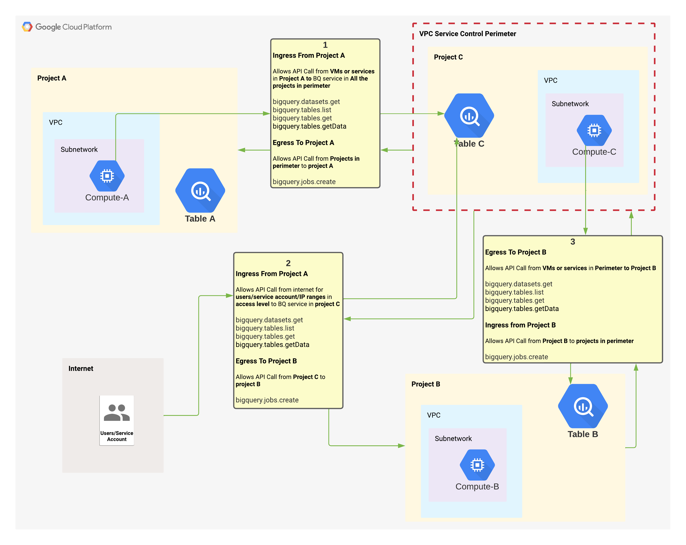

# VPC Service Control Egress and Ingress Policies

  

##  From Internet

###  Execute query on BQ tables in project C using project Project B for BQ jobs.
`PASS` as there is an ingress policy which allows `bigquery.tables.getData` from internet and there is an egress policy which allows `bigquery.jobs.create` to project B where BQ job will be created for this request 

```bash
bq query --use_legacy_sql=false --project_id=vpcsc-prj-b-5992  'select x from `vpcsc-prj-c-5c5f.myds.mytable`;'
```

###  Execute query on BQ tables in project C using project Project C for BQ jobs.
`FAIL` as there is no ingress policy which allows `bigquery.jobs.create` from internet

```bash
bq query --use_legacy_sql=false --project_id=vpcsc-prj-c-5c5f  'select x from `vpcsc-prj-c-5c5f.myds.mytable`;'
```
#### ERROR

```json
      "ingressViolations": [
        {
          "targetResourcePermissions": [
            "bigquery.jobs.create"
          ],
          "servicePerimeter": "accessPolicies/399093724144/servicePerimeters/sp_vpcsc_perimeter_c",
          "targetResource": "projects/520554704371"
        }
      ],
```


##  From Project A

###  Execute query on BQ tables in project C using project Project A for BQ jobs.
`PASS` as there is an ingress policy which allows `bigquery.tables.getData` from internet and there is an egress policy which allows `bigquery.jobs.create` to project B where BQ job will be created for this request 


```bash
bq query --use_legacy_sql=false 'select x from `vpcsc-prj-c-5c5f.myds.mytable`;'
```


###  Execute query on BQ tables in project C using project Project C for BQ jobs.
`FAIL` as there is no ingress policy which allows `bigquery.jobs.create` from A


```bash
bq query --use_legacy_sql=false --project_id=vpcsc-prj-c-5c5f  'select x from `vpcsc-prj-c-5c5f.myds.mytable`;'
```

#### ERROR

```json
      "ingressViolations": [
        {
          "targetResource": "projects/520554704371",
          "source": "projects/754646942972",
          "servicePerimeter": "accessPolicies/399093724144/servicePerimeters/sp_vpcsc_perimeter_c",
          "targetResourcePermissions": [
            "bigquery.jobs.create"
          ]
        }
      ],
```


##  From Project C

###  Execute query on BQ tables in project B using project Project C for BQ jobs.
`PASS` as there is an egress policy which allows `bigquery.tables.getData` from project B and there is an ingress policy which allows `bigquery.jobs.create` from project B. BQ job will be created for this request in project C 


```bash
bq query --use_legacy_sql=false 'select x from `vpcsc-prj-b-5992.myds.mytable`;'
```

###  Execute query on BQ tables in project B using project Project B for BQ jobs.

`FAIL` as there is no egress policy which allows `bigquery.jobs.create` to project B. BQ job will be created for this request in project B 


```bash
bq query --use_legacy_sql=false --project_id=vpcsc-prj-b-5992 'select x from `vpcsc-prj-b-5992.myds.mytable`;'
```


#### ERROR

```json
      "egressViolations": [
        {
          "targetResource": "projects/599795189996",
          "targetResourcePermissions": [
            "bigquery.jobs.create"
          ],
          "sourceType": "Network",
          "source": "projects/520554704371",
          "servicePerimeter": "accessPolicies/399093724144/servicePerimeters/sp_vpcsc_perimeter_c"
        }
      ]
```
